# Jeu de Recyclage pour Enfants (4-6 ans)
Ceci est un jeu de recyclage amusant et éducatif conçu pour les enfants âgés de 4 à 6 ans ! Notre jeu vise à enseigner aux jeunes enfants l'importance du recyclage de façon ludique et interactive. En jouant, les enfants apprendront à trier correctement les différents types de déchets, comprendront les bienfaits du recyclage, et développeront des habitudes écoresponsables dès le plus jeune âge.

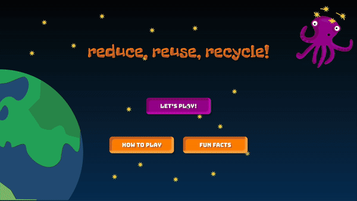

### Captures d'écran

### Tri des Déchets ♻️
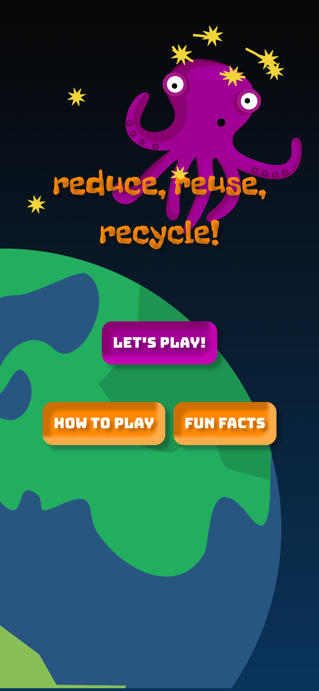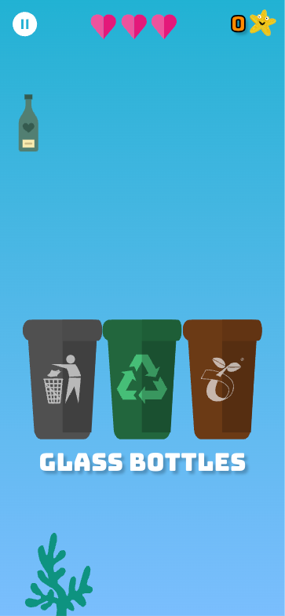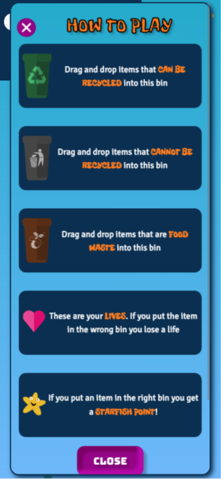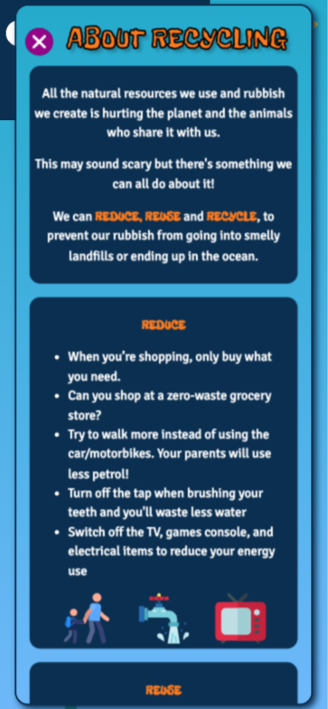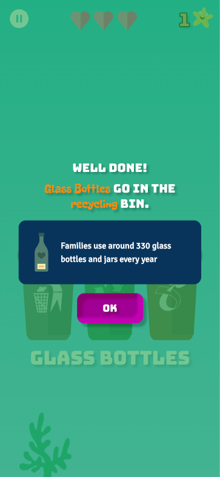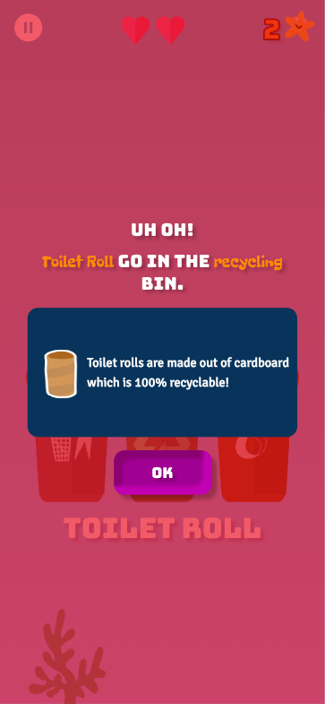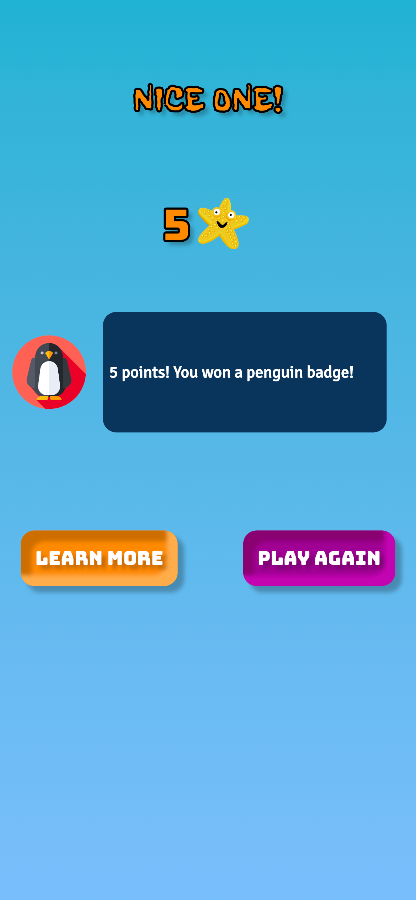

### Puzzle des Déchets 🧩
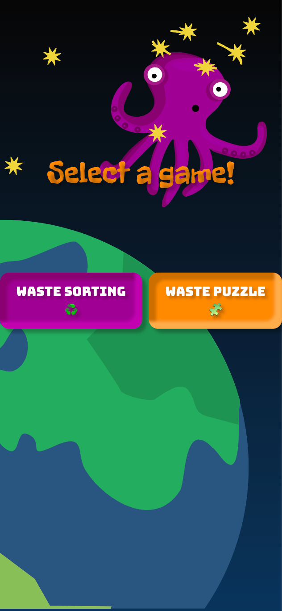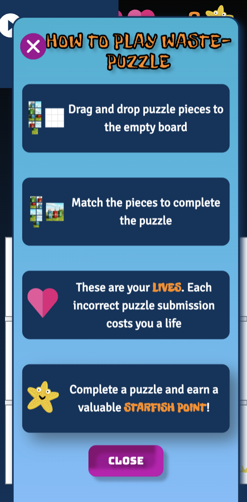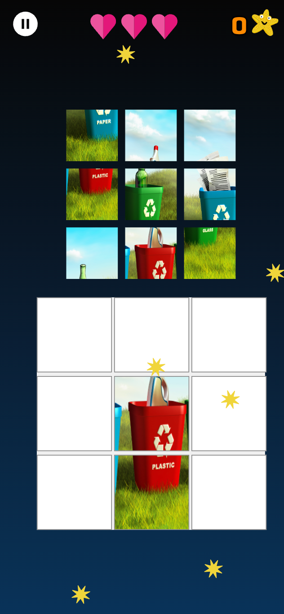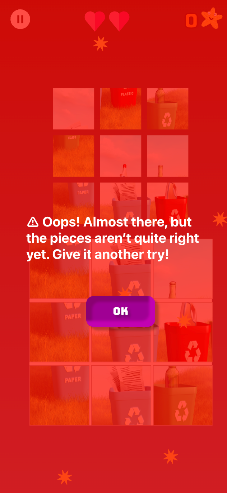
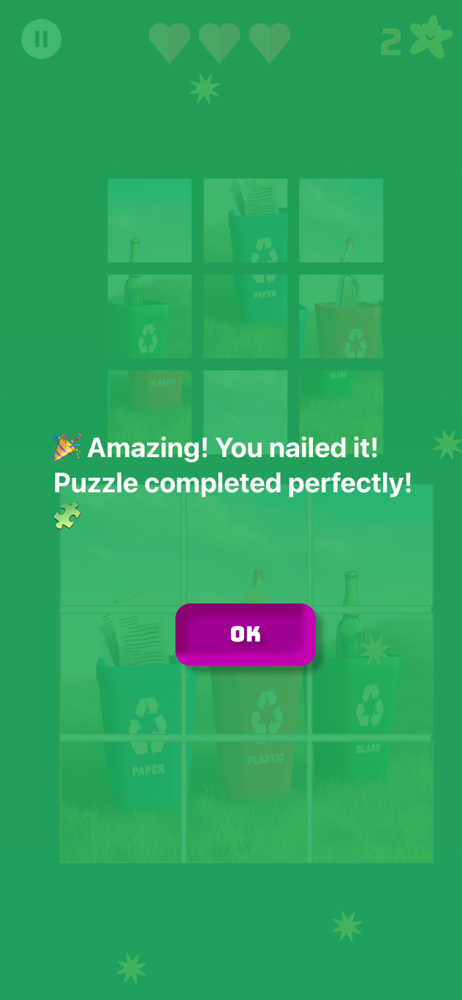

## Pour Commencer
Ce projet a été créé avec [Create React App](https://github.com/facebook/create-react-app).

### Scripts Disponibles
Dans le répertoire du projet, vous pouvez exécuter :

#### `npm start`
Lance l'application en mode développement. Ouvrez [http://localhost:3000](http://localhost:3000) pour la voir dans le navigateur. La page se rechargera si vous faites des modifications, et vous verrez également les erreurs de lint dans la console.

#### `npm test`
Lance le testeur en mode surveillance interactif. Consultez la section sur [l'exécution des tests](https://facebook.github.io/create-react-app/docs/running-tests) pour plus d'informations.

#### `npm run build`
Compile l'application pour la production dans le dossier `build`. Cela regroupe correctement React en mode production et optimise la compilation pour de meilleures performances. La compilation est minifiée et les noms de fichiers incluent les hachages. Votre application est prête à être déployée ! Consultez la section sur le [déploiement](https://facebook.github.io/create-react-app/docs/deployment) pour plus d'informations.

#### `npm run eject`
**Remarque : cette opération est irréversible. Une fois que vous avez fait `eject`, vous ne pouvez plus revenir en arrière !** Cette commande supprimera la dépendance de compilation unique de votre projet. Elle copiera tous les fichiers de configuration et les dépendances (Webpack, Babel, ESLint, etc.) directement dans votre projet afin que vous ayez un contrôle total sur ceux-ci. À partir de là, vous êtes autonome. Vous n'êtes pas obligé d'utiliser `eject`, mais c'est une option si vous avez besoin de personnaliser la configuration.

## En Savoir Plus
- [Documentation Create React App](https://facebook.github.io/create-react-app/docs/getting-started)
- [Documentation React](https://reactjs.org/)

### Ressources Complémentaires
- [Découpage du Code (Code Splitting)](https://facebook.github.io/create-react-app/docs/code-splitting)
- [Analyse de la Taille du Bundle](https://facebook.github.io/create-react-app/docs/analyzing-the-bundle-size)
- [Créer une Progressive Web App](https://facebook.github.io/create-react-app/docs/making-a-progressive-web-app)
- [Configuration Avancée](https://facebook.github.io/create-react-app/docs/advanced-configuration)
- [Déploiement](https://facebook.github.io/create-react-app/docs/deployment)
- [Dépannage des Erreurs de Compilation](https://facebook.github.io/create-react-app/docs/troubleshooting#npm-run-build-fails-to-minify)

## Remerciements
Ce projet est détaché de fac18 [recycling-game](https://github.com/fac18/recycling-game).
